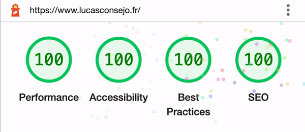

<div align="center">
  <a href="https://www.lucasconsejo.fr">
    
  </a>

  <h3 align="center">lucasconsejo.fr</h3>

  <p align="center">
    Site porfolio de Lucas Consejo, développeur web & mobile.
  </p>
</div>

<details>
  <summary>Table des matières</summary>
  <ol>
    <li><a href="#a-propos-du-projet">A propos du projet</a>
    </li>
    <li>
      <a href="#getting-started">Getting Started</a>
      <ul>
        <li><a href="#prérequis">Prérequis</a></li>
        <li><a href="#installation">Installation</a></li>
      </ul>
    </li>
    <li><a href="#lighthouse">Lighthouse</a></li>
    <li><a href="#roadmap">Roadmap</a></li>
  </ol>
</details>

## A propos du projet

<a href="https://www.lucasconsejo.fr">
    
</a>

## Technologies utilisées

* [Next.js](https://nextjs.org/)
* [React.js](https://reactjs.org/)
* [Typescript](https://www.typescriptlang.org/)
* [TailwindCSS](https://tailwindcss.com/)

## Getting Started

### Prérequis

Ce projet utilise des packages NPM. Il est donc requis d'avoir installer NPM. 

Facultatif : Installer yarn

> Par habitude, je préfère utiliser `yarn` plutôt que `npm`.

### Installation

1. Cloner le repo
   ```sh
    git clone https://github.com/lucasconsejo/lucasconsejo.fr.git
   ```
2. Installation
   ```sh
    yarn install
    # ou
    npm install
   ```
3. Lancer le projet
   ```sh
    yarn dev
    # ou
    npm run dev
   ```

## Lighthouse

Je suis pas peu fier du score Google Lighthouse 🥳



## Roadmap

- [x] Multi-langue :
    - [x] Français
    - [x] English
- [ ] Code refacto
- [ ] Ajout de tests unitaires

Lucas Consejo ⚡
